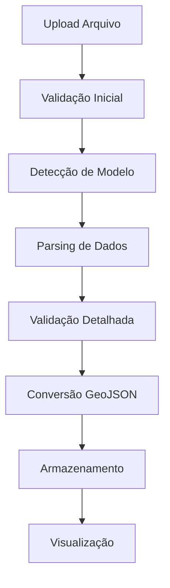

# 🧬 Sistema de Análise de Ancestralidade Genética - Admixture

> **Arquitetura Monolítica Flask** para processamento e visualização de dados genéticos Admixture com mapeamento georreferenciado

## 📋 Índice

- [Visão Geral da Arquitetura](#-visão-geral-da-arquitetura)
- [Requisitos Funcionais](#-requisitos-funcionais)
- [Requisitos de Domínio](#-requisitos-de-domínio)
- [Estrutura do Projeto](#-estrutura-do-projeto)
- [Módulos e Componentes](#-módulos-e-componentes)
- [Fluxo de Dados](#-fluxo-de-dados)
- [Implementação dos Requisitos](#-implementação-dos-requisitos)
- [Configuração e Setup](#-configuração-e-setup)
- [Guia de Desenvolvimento](#-guia-de-desenvolvimento)
- [API e Endpoints](#-api-e-endpoints)
- [Testes](#-testes)

## 🏗 Visão Geral da Arquitetura

### Padrão Arquitetural: **Monolito Modular**

O sistema utiliza uma arquitetura monolítica modular baseada em Flask, organizando funcionalidades em módulos especializados para facilitar manutenção e escalabilidade.

```
┌─────────────────────────────────────────────────────────────┐
│                    CAMADA DE APRESENTAÇÃO                   │
│  ┌─────────────┐  ┌─────────────┐  ┌─────────────────────┐ │
│  │   Web UI    │  │  REST API   │  │   Admin Panel       │ │
│  │ (Templates) │  │   (JSON)    │  │   (Dashboard)       │ │
│  └─────────────┘  └─────────────┘  └─────────────────────┘ │
└─────────────────────────────────────────────────────────────┘
                              │
┌─────────────────────────────────────────────────────────────┐
│                    CAMADA DE NEGÓCIO                        │
│  ┌─────────────┐  ┌─────────────┐  ┌─────────────────────┐ │
│  │  Parsing &  │  │ Validação & │  │  Conversão GeoJSON  │ │
│  │  Detecção   │  │   Errors    │  │  & Mapeamento       │ │
│  └─────────────┘  └─────────────┘  └─────────────────────┘ │
└─────────────────────────────────────────────────────────────┘
                              │
┌─────────────────────────────────────────────────────────────┐
│                    CAMADA DE DADOS                          │
│  ┌─────────────┐  ┌─────────────┐  ┌─────────────────────┐ │
│  │  SQLAlchemy │  │   GeoJSON   │  │   File Storage      │ │
│  │   Models    │  │   Layers    │  │   (Uploads)         │ │
│  └─────────────┘  └─────────────┘  └─────────────────────┘ │
└─────────────────────────────────────────────────────────────┘
```

## 📋 Requisitos Funcionais

### [RF003] - Detecção Automática de Modelo
**Módulo:** `app/services/admixture_parser.py`

```python
class AdmixtureModelDetector:
    """Detecta automaticamente o modelo Admixture utilizado"""
    
    SUPPORTED_MODELS = {
        'K36': {'components': 36, 'pattern': r'K36'},
        'K15': {'components': 15, 'pattern': r'K15'},
        'K12': {'components': 12, 'pattern': r'K12'}
    }
    
    def detect_model(self, data: str) -> dict:
        """Algoritmo de detecção baseado em padrões e contagem"""
        pass
```

### [RF004] - Validação de Dados
**Módulo:** `app/services/data_validator.py`

```python
class AdmixtureDataValidator:
    """Valida estrutura e formato dos dados Admixture"""
    
    def validate_format(self, data: str) -> ValidationResult:
        """Valida formato e estrutura dos dados"""
        pass
        
    def validate_percentages(self, components: list) -> bool:
        """Verifica se percentuais somam 100%"""
        pass
```

### [RF005] - Conversão Georreferenciada
**Módulo:** `app/services/geo_converter.py`

```python
class GeoConverter:
    """Converte dados Admixture em GeoJSON georreferenciado"""
    
    def convert_to_geojson(self, admixture_data: dict, model: str) -> dict:
        """Gera GeoJSON com proporções por região"""
        pass
        
    def assign_colors(self, percentages: dict) -> dict:
        """Atribui cores proporcionais às intensidades"""
        pass
```

## 🎯 Requisitos de Domínio

### [RD001] - Suporte a Modelos Específicos
**Módulo:** `app/models/admixture_models.py`

```python
class AdmixtureModel(db.Model):
    """Modelo base para configurações Admixture"""
    
    id = db.Column(db.Integer, primary_key=True)
    name = db.Column(db.String(50), unique=True, nullable=False)
    components_count = db.Column(db.Integer, nullable=False)
    regions_config = db.Column(db.JSON, nullable=False)
    color_palette = db.Column(db.JSON, nullable=False)
```

### [RD002] - Proporções por Região
**Módulo:** `app/services/region_calculator.py`

```python
class RegionProportionCalculator:
    """Calcula proporções ancestrais por região geográfica"""
    
    def calculate_regional_proportions(self, data: dict, model: str) -> dict:
        """Algoritmo de mapeamento geográfico"""
        pass
```

### [RD003] - Mapeamento Dinâmico
**Módulo:** `app/services/dynamic_mapper.py`

```python
class DynamicMapper:
    """Sistema de configuração dinâmica por modelo"""
    
    def load_model_config(self, model_name: str) -> dict:
        """Carrega configuração específica do modelo"""
        pass
        
    def generate_color_scheme(self, components_count: int) -> list:
        """Gera esquema de cores dinâmico"""
        pass
```

## 📁 Estrutura do Projeto

```
Dna/
├── app/
│   ├── __init__.py                 # Factory da aplicação
│   ├── models/                     # Modelos de dados
│   │   ├── __init__.py
│   │   ├── user.py                # Modelo de usuário
│   │   ├── post.py                # Modelo de posts
│   │   ├── admixture_models.py    # 🧬 Modelos Admixture
│   │   ├── analysis_session.py    # 🧬 Sessões de análise
│   │   └── geo_data.py            # 🧬 Dados geográficos
│   ├── routes/                    # Blueprints e rotas
│   │   ├── __init__.py
│   │   ├── main.py               # Rotas principais
│   │   ├── auth.py               # Autenticação
│   │   ├── api.py                # API REST
│   │   ├── admin.py              # Administração
│   │   └── admixture.py          # 🧬 Rotas Admixture
│   ├── services/                 # 🧬 Lógica de negócio
│   │   ├── __init__.py
│   │   ├── admixture_parser.py   # Parser e detecção
│   │   ├── data_validator.py     # Validação de dados
│   │   ├── geo_converter.py      # Conversão GeoJSON
│   │   ├── region_calculator.py  # Cálculo de proporções
│   │   ├── dynamic_mapper.py     # Mapeamento dinâmico
│   │   └── color_generator.py    # Geração de cores
│   ├── utils/                    # 🧬 Utilitários
│   │   ├── __init__.py
│   │   ├── file_handlers.py      # Manipulação de arquivos
│   │   ├── geojson_utils.py      # Utilitários GeoJSON
│   │   └── math_utils.py         # Cálculos matemáticos
│   ├── static/                   # Arquivos estáticos
│   │   ├── css/
│   │   ├── js/
│   │   │   └── admixture-map.js  # 🧬 JavaScript do mapa
│   │   ├── geojson/              # 🧬 Camadas GeoJSON
│   │   │   ├── k36_regions.json
│   │   │   ├── k15_regions.json
│   │   │   └── k12_regions.json
│   │   └── images/
│   └── templates/                # Templates HTML
│       ├── base.html
│       ├── main/
│       ├── auth/
│       ├── admin/
│       └── admixture/            # 🧬 Templates Admixture
│           ├── upload.html
│           ├── analysis.html
│           └── results.html
├── migrations/                   # Migrações do banco
├── tests/                       # Testes
│   ├── test_admixture_parser.py # 🧬 Testes do parser
│   ├── test_data_validator.py   # 🧬 Testes de validação
│   └── test_geo_converter.py    # 🧬 Testes de conversão
├── uploads/                     # Arquivos enviados
├── logs/                        # Logs da aplicação
├── app.py                       # Arquivo principal
├── admixture_app.py            # 🧬 App Admixture standalone
├── config.py                    # Configurações
├── cli.py                       # Comandos CLI
├── requirements.txt             # Dependências
├── .env.example                # Exemplo de variáveis
├── Dockerfile                   # Docker
├── docker-compose.yml          # Docker Compose
└── README.md                    # Este arquivo
```

## 🔧 Módulos e Componentes

### 1. **Módulo de Parsing e Detecção** (`app/services/admixture_parser.py`)

**Responsabilidades:**
- Análise de arquivos Admixture (.txt)
- Detecção automática do modelo (K36, K15, K12, etc.)
- Extração de componentes e percentuais
- Identificação de padrões nos dados

**Algoritmos Implementados:**
- Parser de texto estruturado
- Detecção por contagem de componentes
- Validação de formato de entrada
- Normalização de dados

### 2. **Módulo de Validação** (`app/services/data_validator.py`)

**Responsabilidades:**
- Validação de estrutura dos dados
- Verificação de integridade dos percentuais
- Detecção de erros de formatação
- Sanitização de entrada

**Validações Implementadas:**
- Soma de percentuais = 100%
- Formato numérico válido
- Estrutura de dados consistente
- Detecção de valores ausentes

### 3. **Módulo de Conversão GeoJSON** (`app/services/geo_converter.py`)

**Responsabilidades:**
- Conversão de dados Admixture para GeoJSON
- Mapeamento de componentes para regiões
- Atribuição de cores proporcionais
- Geração de camadas geográficas

**Algoritmos de Conversão:**
- Mapeamento componente → região geográfica
- Cálculo de intensidade de cor
- Geração de propriedades GeoJSON
- Otimização de dados geográficos

### 4. **Módulo de Modelos de Dados** (`app/models/`)

**Entidades Principais:**

```python
# Modelo de configuração Admixture
class AdmixtureModel(db.Model):
    id = db.Column(db.Integer, primary_key=True)
    name = db.Column(db.String(50), unique=True)  # K36, K15, K12
    components_count = db.Column(db.Integer)
    regions_mapping = db.Column(db.JSON)  # Mapeamento componente→região
    color_palette = db.Column(db.JSON)    # Paleta de cores
    geojson_layer = db.Column(db.Text)    # Camada GeoJSON base

# Sessão de análise
class AnalysisSession(db.Model):
    id = db.Column(db.Integer, primary_key=True)
    user_id = db.Column(db.Integer, db.ForeignKey('user.id'))
    model_detected = db.Column(db.String(50))
    raw_data = db.Column(db.Text)         # Dados originais
    processed_data = db.Column(db.JSON)   # Dados processados
    geojson_result = db.Column(db.Text)   # GeoJSON resultante
    created_at = db.Column(db.DateTime)

# Dados geográficos processados
class GeoData(db.Model):
    id = db.Column(db.Integer, primary_key=True)
    session_id = db.Column(db.Integer, db.ForeignKey('analysis_session.id'))
    region_name = db.Column(db.String(100))
    component_name = db.Column(db.String(100))
    percentage = db.Column(db.Float)
    color_hex = db.Column(db.String(7))   # Cor em hexadecimal
```

## 🔄 Fluxo de Dados

### 1. **Upload e Processamento**



### 2. **Pipeline de Processamento**

```python
# Fluxo principal de processamento
def process_admixture_data(file_content: str) -> dict:
    """
    Pipeline completo de processamento de dados Admixture
    """
    # 1. Validação inicial
    validator = AdmixtureDataValidator()
    validation_result = validator.validate_format(file_content)
    
    if not validation_result.is_valid:
        raise ValidationError(validation_result.errors)
    
    # 2. Detecção de modelo
    detector = AdmixtureModelDetector()
    model_info = detector.detect_model(file_content)
    
    # 3. Parsing de dados
    parser = AdmixtureParser()
    parsed_data = parser.parse(file_content, model_info)
    
    # 4. Validação detalhada
    detailed_validation = validator.validate_percentages(parsed_data)
    
    # 5. Conversão para GeoJSON
    converter = GeoConverter()
    geojson_data = converter.convert_to_geojson(parsed_data, model_info)
    
    # 6. Atribuição de cores
    colored_geojson = converter.assign_colors(geojson_data)
    
    return {
        'model': model_info,
        'data': parsed_data,
        'geojson': colored_geojson,
        'validation': detailed_validation
    }
```

## 🛠 Implementação dos Requisitos

### **RF003 - Detecção Automática de Modelo**

**Localização:** `app/services/admixture_parser.py`

```python
class AdmixtureModelDetector:
    """Implementa algoritmos de detecção automática de modelo"""
    
    def __init__(self):
        self.model_patterns = {
            'K36': {
                'components': 36,
                'keywords': ['Eurogenes', 'K36', '36 components'],
                'component_names': ['Amerindian', 'Arabian', 'Armenian', ...]
            },
            'K15': {
                'components': 15,
                'keywords': ['Eurogenes', 'K15', '15 components'],
                'component_names': ['North_European', 'Mediterranean', ...]
            },
            'K12': {
                'components': 12,
                'keywords': ['Dodecad', 'K12b', '12 components'],
                'component_names': ['Caucasus', 'Southern', 'Atlantic_Med', ...]
            }
        }
    
    def detect_model(self, data: str) -> dict:
        """Detecta modelo baseado em padrões e contagem"""
        # Algoritmo 1: Detecção por palavras-chave
        for model_name, config in self.model_patterns.items():
            for keyword in config['keywords']:
                if keyword.lower() in data.lower():
                    return {'name': model_name, 'config': config}
        
        # Algoritmo 2: Detecção por contagem de componentes
        components_count = self._count_components(data)
        for model_name, config in self.model_patterns.items():
            if config['components'] == components_count:
                return {'name': model_name, 'config': config}
        
        # Algoritmo 3: Detecção por nomes de componentes
        detected_components = self._extract_component_names(data)
        for model_name, config in self.model_patterns.items():
            match_score = self._calculate_match_score(
                detected_components, config['component_names']
            )
            if match_score > 0.8:  # 80% de similaridade
                return {'name': model_name, 'config': config}
        
        raise ModelDetectionError("Não foi possível detectar o modelo")
```

### **RF004 - Validação de Dados**

**Localização:** `app/services/data_validator.py`

```python
class AdmixtureDataValidator:
    """Implementa validações robustas para dados Admixture"""
    
    def validate_format(self, data: str) -> ValidationResult:
        """Valida formato e estrutura dos dados"""
        errors = []
        warnings = []
        
        # Validação 1: Estrutura básica
        if not self._has_valid_structure(data):
            errors.append("Estrutura de dados inválida")
        
        # Validação 2: Formato numérico
        invalid_numbers = self._find_invalid_numbers(data)
        if invalid_numbers:
            errors.extend([f"Valor inválido: {num}" for num in invalid_numbers])
        
        # Validação 3: Completude dos dados
        missing_components = self._find_missing_components(data)
        if missing_components:
            warnings.extend([f"Componente ausente: {comp}" for comp in missing_components])
        
        return ValidationResult(
            is_valid=len(errors) == 0,
            errors=errors,
            warnings=warnings
        )
    
    def validate_percentages(self, components: dict) -> bool:
        """Verifica se percentuais somam 100% (±0.1% tolerância)"""
        total = sum(components.values())
        return abs(total - 100.0) <= 0.1
```

### **RF005 - Conversão Georreferenciada**

**Localização:** `app/services/geo_converter.py`

```python
class GeoConverter:
    """Converte dados Admixture em GeoJSON georreferenciado"""
    
    def __init__(self):
        self.geojson_layers = self._load_geojson_layers()
        self.color_generator = ColorGenerator()
    
    def convert_to_geojson(self, admixture_data: dict, model: str) -> dict:
        """Gera GeoJSON com proporções por região"""
        base_layer = self.geojson_layers[model]
        result_geojson = copy.deepcopy(base_layer)
        
        # Mapear componentes para regiões
        region_mapping = self._get_region_mapping(model)
        
        for feature in result_geojson['features']:
            region_name = feature['properties']['name']
            
            # Calcular proporção total para esta região
            total_proportion = 0
            region_components = []
            
            for component, percentage in admixture_data.items():
                if component in region_mapping.get(region_name, []):
                    total_proportion += percentage
                    region_components.append({
                        'component': component,
                        'percentage': percentage
                    })
            
            # Adicionar propriedades ao feature
            feature['properties'].update({
                'total_proportion': total_proportion,
                'components': region_components,
                'color': self._calculate_region_color(total_proportion),
                'opacity': min(total_proportion / 100, 1.0)
            })
        
        return result_geojson
    
    def assign_colors(self, geojson_data: dict) -> dict:
        """Atribui cores proporcionais às intensidades"""
        max_proportion = max(
            feature['properties']['total_proportion']
            for feature in geojson_data['features']
        )
        
        for feature in geojson_data['features']:
            proportion = feature['properties']['total_proportion']
            intensity = proportion / max_proportion if max_proportion > 0 else 0
            
            feature['properties']['color'] = self.color_generator.generate_color(
                intensity=intensity,
                base_color='#3b82f6'  # Azul base
            )
        
        return geojson_data
```

## ⚙️ Configuração e Setup

### 1. **Instalação**

```bash
# Clone o repositório
git clone <repository-url>
cd Dna

# Crie ambiente virtual
python -m venv venv
venv\Scripts\activate  # Windows
# source venv/bin/activate  # Linux/Mac

# Instale dependências
pip install -r requirements.txt

# Configure variáveis de ambiente
cp .env.example .env
```

### 2. **Configuração do Banco de Dados**

```bash
# Inicializar banco
flask init-db

# Criar tabelas Admixture
flask db migrate -m "Add Admixture models"
flask db upgrade

# Carregar dados iniciais
flask seed-admixture-models
```

### 3. **Configuração de Camadas GeoJSON**

```bash
# Criar diretório para camadas
mkdir app/static/geojson

# Baixar camadas base (exemplo)
wget -O app/static/geojson/k36_regions.json <url-k36>
wget -O app/static/geojson/k15_regions.json <url-k15>
wget -O app/static/geojson/k12_regions.json <url-k12>
```

### 4. **Variáveis de Ambiente**

```env
# .env
FLASK_APP=app.py
FLASK_ENV=development
SECRET_KEY=sua-chave-secreta
DATABASE_URL=sqlite:///admixture.db

# Configurações Admixture
MAX_FILE_SIZE=10485760  # 10MB
ALLOWED_EXTENSIONS=txt,csv
GEOJSON_CACHE_TTL=3600
COLOR_PALETTE_DEFAULT=viridis

# Mapbox (para visualização)
MAPBOX_ACCESS_TOKEN=seu-token-mapbox
```

## 🚀 Guia de Desenvolvimento

### 1. **Implementando um Novo Modelo**

```python
# 1. Adicionar configuração em app/services/admixture_parser.py
class AdmixtureModelDetector:
    def __init__(self):
        self.model_patterns.update({
            'K25': {
                'components': 25,
                'keywords': ['K25', '25 components'],
                'component_names': ['Component1', 'Component2', ...]
            }
        })

# 2. Criar camada GeoJSON em app/static/geojson/k25_regions.json

# 3. Adicionar mapeamento região-componente
# 4. Configurar paleta de cores específica
# 5. Criar testes unitários
```

### 2. **Adicionando Nova Validação**

```python
# app/services/data_validator.py
class AdmixtureDataValidator:
    def validate_custom_rule(self, data: dict) -> bool:
        """Implementar nova regra de validação"""
        # Sua lógica aqui
        pass
    
    def validate_format(self, data: str) -> ValidationResult:
        # Adicionar nova validação ao pipeline existente
        if not self.validate_custom_rule(parsed_data):
            errors.append("Falha na validação customizada")
```

### 3. **Criando Novo Endpoint API**

```python
# app/routes/admixture.py
@admixture_bp.route('/api/analyze', methods=['POST'])
@jwt_required()
def analyze_admixture():
    """Endpoint para análise de dados Admixture"""
    try:
        # Obter dados do request
        data = request.get_json()
        file_content = data.get('content')
        
        # Processar dados
        result = process_admixture_data(file_content)
        
        # Salvar sessão
        session = AnalysisSession(
            user_id=get_jwt_identity(),
            model_detected=result['model']['name'],
            raw_data=file_content,
            processed_data=result['data'],
            geojson_result=json.dumps(result['geojson'])
        )
        db.session.add(session)
        db.session.commit()
        
        return jsonify({
            'success': True,
            'session_id': session.id,
            'model': result['model'],
            'geojson': result['geojson']
        })
        
    except ValidationError as e:
        return jsonify({
            'success': False,
            'error': 'Dados inválidos',
            'details': str(e)
        }), 400
```

## 📡 API e Endpoints

### **Endpoints Principais**

```python
# Análise de dados
POST /api/admixture/analyze
{
    "content": "dados admixture em texto",
    "format": "txt"
}

# Obter resultado de análise
GET /api/admixture/session/{session_id}

# Listar modelos suportados
GET /api/admixture/models

# Obter camada GeoJSON para modelo
GET /api/admixture/geojson/{model_name}

# Upload de arquivo
POST /api/admixture/upload
# FormData com arquivo

# Validar dados sem processar
POST /api/admixture/validate
{
    "content": "dados para validação"
}
```

### **Respostas da API**

```json
// Resposta de análise bem-sucedida
{
    "success": true,
    "session_id": 123,
    "model": {
        "name": "K36",
        "components": 36,
        "confidence": 0.95
    },
    "geojson": {
        "type": "FeatureCollection",
        "features": [...]
    },
    "statistics": {
        "total_components": 36,
        "max_percentage": 45.2,
        "dominant_region": "Europe"
    }
}

// Resposta de erro de validação
{
    "success": false,
    "error": "Dados inválidos",
    "details": {
        "errors": [
            "Percentuais não somam 100%",
            "Componente 'Invalid' não reconhecido"
        ],
        "warnings": [
            "Componente 'European' com valor muito baixo"
        ]
    }
}
```

## 🧪 Testes

### **Estrutura de Testes**

```python
# tests/test_admixture_parser.py
class TestAdmixtureParser:
    def test_detect_k36_model(self):
        """Testa detecção do modelo K36"""
        sample_data = "Eurogenes K36 results..."
        detector = AdmixtureModelDetector()
        result = detector.detect_model(sample_data)
        assert result['name'] == 'K36'
    
    def test_parse_valid_data(self):
        """Testa parsing de dados válidos"""
        pass
    
    def test_handle_invalid_format(self):
        """Testa tratamento de formato inválido"""
        pass

# tests/test_data_validator.py
class TestDataValidator:
    def test_validate_percentages_sum(self):
        """Testa validação de soma de percentuais"""
        pass
    
    def test_detect_format_errors(self):
        """Testa detecção de erros de formato"""
        pass

# tests/test_geo_converter.py
class TestGeoConverter:
    def test_convert_to_geojson(self):
        """Testa conversão para GeoJSON"""
        pass
    
    def test_color_assignment(self):
        """Testa atribuição de cores"""
        pass
```

### **Executar Testes**

```bash
# Todos os testes
pytest

# Testes específicos
pytest tests/test_admixture_parser.py

# Com cobertura
pytest --cov=app --cov-report=html

# Testes de integração
pytest tests/integration/
```

## 🔧 Comandos CLI Específicos

```bash
# Carregar modelos Admixture padrão
flask seed-admixture-models

# Validar camadas GeoJSON
flask validate-geojson

# Processar arquivo em lote
flask process-batch --input-dir uploads/ --output-dir results/

# Estatísticas de uso
flask admixture-stats

# Limpar sessões antigas
flask cleanup-sessions --days 30
```

---

## 📝 Próximos Passos para Implementação

1. **Implementar módulos de parsing e detecção**
2. **Criar sistema de validação robusto**
3. **Desenvolver conversores GeoJSON**
4. **Configurar camadas geográficas**
5. **Implementar interface de upload**
6. **Criar visualização interativa**
7. **Adicionar testes abrangentes**
8. **Documentar API completa**

**Desenvolvido com ❤️ para análise de ancestralidade genética**# asdad
